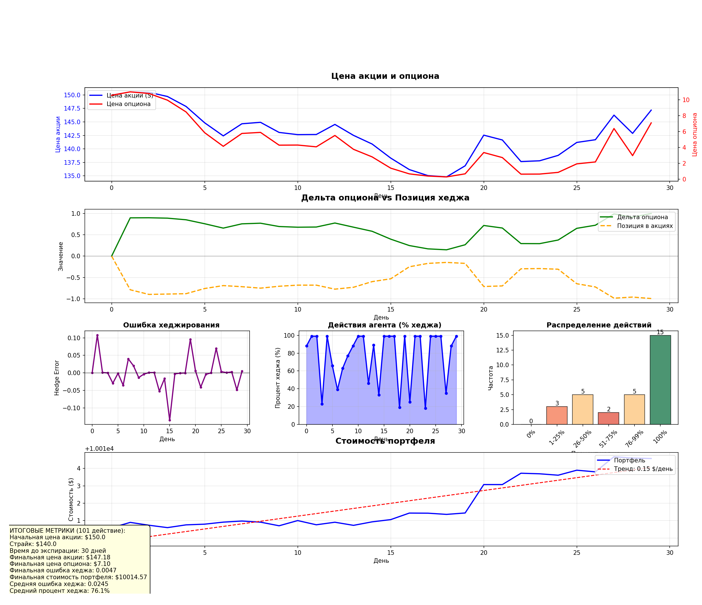

# PSO-калибровка + RL AGENT для хеджирования опциона

Проект разделен на 2 части:
1) часть - калибровка параметров модели Хестона с помощью алгоритма PSO
2) часть - создание RL-агента для хеджирования 1-ого опциона

## PSO-калибровка:
используем алгоритм роя частиц (Particle Swarm Optimization) для подбора 5 параметров модели Хестона: начальная волатильность (v0), скорость возврата к среднему (kappa), долгосрочная волатильность (theta), волатильность волатильности (xi), кореляция между ценой акции и её волатильностью (cor)

в качестве данных используется синтетический датасет из 121 ATM опциона с различными сроками экспирации и страйками, сгенерированный по модели Хестона с известными истинными параметрами. Функция потерь сравнивает подразумеваемую волатильность, генерируемую тестируемыми параметрами, с рыночной IV, накладывая жесткие штрафы за нарушение финансовой адекватности (условие Феллера, реалистичные границы параметров)

Добавлен механизм анти-стагнации (если лучшая точка долго не меняется -> пересчитваем ошибку для неё -> если она на порядок хуже лучшей -> смещаем лучшую точку)

за 100 итераций алгоритм находит параметры с ошибкой менее 8% от истинных 

## RL-агент для хеджирования (DQN)

На втором этапе калиброванные параметры модели Хестона передаются в среду хеджирования, где DQN-агент обучается управлять позицией в акциях для одного опциона колл на протяжении 90 дней

Агент видит 6 параметров: moneyness с дивидендами, время до экспирации, текущую дельту опциона, текущую позицию в акциях, нормированный объем денежных средств и предыдущее действие. На основе этого состояния он выбирает процент хеджирования от 0 до 100 процентов с шагом 1 процент. (101 действие)

Функция награды взята так, чтобы агент самостоятельно находил баланс между:
    - Прибыльностью (daily PnL)
    - Риском (отклонение от целевой дельты)
    - Транзакционными издержками
    - кризисной защитой (катастрофические штрафы при сильных падениях)
    - стабильностью (Sharpe)
    
Особенностью данной реализации является то, что рыночная динамика включает в себя случайные кризисы разной интенсивности (коррекция и кризисы) длительностью от 3 до 15 дней, что делает среду реалистичнее и заставляет агента учиться защищаться

После обучения агент тестируется на новой случайной траектории. Результаты визуализируются на графике, показывающем динамику цен, позицию в акциях, действия агента и стоимость портфеля

Обученный RL-агент демонстрирует способность адаптировать стратегию хеджирования в зависимости от рыночных условий, увеличивая степень защиты в периоды кризисов и экономя на транзакционных издержках в спокойные периоды

## Результаты:

